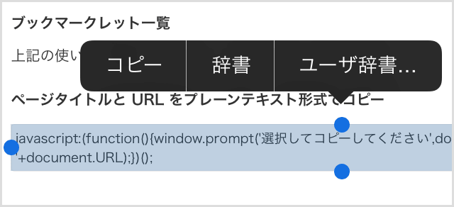

# Copy webpage title & URL bookmarklet for mobile browser

iPhone Safari で使用できるブックマークレットが欲しくて作ったやつです。iPhone 版 Safari などで閲覧中のページのタイトルと URL をコピーするためのポップアップウィンドウを表示します。

PC 版ブラウザでも動作しますが、Firefox なら [Make Link](https://addons.mozilla.org/ja/firefox/addon/make-link/)、Chrome なら [Create Link](https://chrome.google.com/webstore/detail/create-link/gcmghdmnkfdbncmnmlkkglmnnhagajbm) などのプラグインを使った方が早いし便利です。

## 使い方

基本的な使い方は通常のブックマークレットと同じです。

### モバイルブラウザ（iPhone など）の場合

まず一度このページ（実際にはどこでもいいです）をブックマークに追加してください。

次に下記のブックマークレット一覧から、使いたいブックマークレットのソースコードをコピーします。

ソースコードをコピーしたら、ブックマークの管理画面から先ほど追加したブックマークの編集に進みます。

URL の部分を一旦すべて削除した上で、先ほどコピーした内容をペーストして保存します。ブックマークのタイトルも任意でわかりやすく変更しておくとよいでしょう。

閲覧中のページでブックマークからブックマークレットを起動すると、ポップアップウィンドウが立ち上がってテキストが表示されます。これを全選択してコピーしてください。

#### ブックマークレット一覧

上記の使い方を参考にブックマークに登録してください。

##### ページタイトルと URL をプレーンテキスト形式でコピー</h5>

    javascript:(function(){window.prompt('選択してコピーしてください',document.title+' '+document.URL);})();

##### ページタイトルと URL を HTML 形式でコピー</h5>

    javascript:(function(){window.prompt('選択してコピーしてください','&lt;a href=&quot;'+document.URL+'&quot; target=&quot;_blank&quot;&gt;'+document.title+'&lt;/a&gt;');})();

##### ページタイトルと URL を Markdown 形式でコピー

    javascript:(function(){window.prompt('選択してコピーしてください','['+document.title.replace(/[\[\]]/g,'\\$&').replace(/\\$/, '')+']('+document.URL+')');})();

### PC 向けブラウザの場合

下記のブックマークレット一覧から、使いたいブックマークレットのリンクを右クリックし、コンテキストメニューから「お気に入りに追加（IE の場合）」や「このリンクをブックマーク（Firefox の場合）」 などを選択して、ブックマークに登録してください。リンクツールバーに表示しておくと実際に使うとき便利です。また、ブックマークのタイトルは任意でわかりやすく変更しておくとよいでしょう。

もしうまくいかない場合は、追加したブックマークのプロパティから編集画面に進み、URL 欄を確認し、もし先頭に「http:// ～ /」が付いている場合はそれを削除し、「javascript」から始まるようにして保存してください。

#### ブックマークレット一覧

下記のページにブックマークレット一覧がありますので、そこから上記の使い方を参考にブックマークに追加してください。

* [Web ページ のタイトルと URL をコピーするブックマークレット](http://hyper-text.org/archives/2014/07/bookmarklet-copy-title-and-url/)

「モバイルブラウザ（iPhone など）の場合」で書いてあるものと同様の方法でも追加できます。

## その他

下記のページで本ブックマークレットについての解説記事を書いています。参考まで。

* [iPhone Safari などで Web ページ のタイトルと URL をコピーするブックマークレットを作った](http://hyper-text.org/archives/2014/07/bookmarklet_copy_title_and_url.shtml)